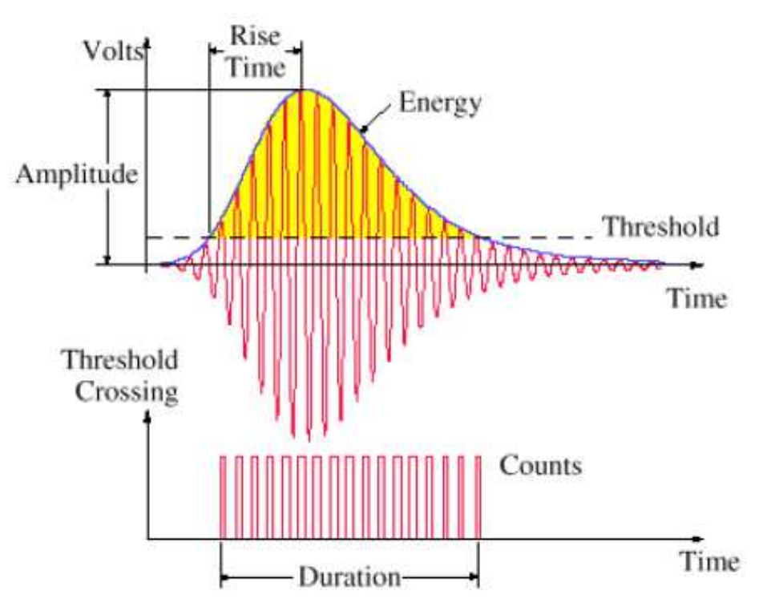

## Akusztikus Emisszió

#### Bevezetés:
Az akusztikus emisszió jelensége egy anyagban terjedő longitudinális hullám. A jelenség szisztematikus vizsgálata 1948-ban indult, majd 1957-re ipari alkalmazásai is születtek. Például nagy nyomású, vagy térfogatú palackok illetve tartályok szivárgását ellenőrzik, valamint hídkábelek fáradását detektálhatják. 
Az általunk vizsgált akusztikus jel **lokális irreverzibilis változások által kibocsájtott rugalmas energiahullám**, mely lecsengő mechanikai feszültségimpulzus formájában terjed a forrása irányából. Az akusztikus jelek vizsgálatának fontosságát kitűnően példázza, hogy diszlokáció dinamikai szimulációkkal is megjósolt heterogén diszlokáció mozgást az irodalomban számos helyen igazolták akusztikus emissziós mérésekkel.

#### Akusztikus emisszió forrásai
Az akusztikus emissziós jeleknek számos forrása van. A feszültségtér változásával járó folyamatok mind keltenek akusztikus jeleket. 
A kristályszerkezetek akusztikus jeleinek egyik fontos forrása a **diszlokáció mozgás**. A diszlokáció mozgás által generált jel függ a mozgás mechanizmusától, más jel keletkezik csúszás, mászás illetve gyorsulás esetén is. Ikerkristály keletkezése valamint az ikerstruktúra növekedése az általuk kibocsájtott akusztikus jelek alapján megkülönböztethető.  A diszlokációk annihilációja során hirtelen eltűnő feszültségtér szintén akusztikus forrás, ahogy a Portevin-Le Chatelier effektus során átvágott kiválások, diszlokáció mozgást akadályozó hatásának megszűnése miatt megváltozó feszültségtér is. Diszlokáció mozgás által kibocsájtott akusztikus jelek vizsgálatakor a mérés szempontjából zavaró akusztikus jelek keletkeznek a mikrorepedések, fázisátalakulások, újrakristályosodás és szemcsehatár csúszás következtében is.

#### Akusztikus jelek detektálása
Az akusztikus emisszió által keltett mechanikai feszültségek a forrástól távol a minta felszínének elmozdulását eredményezik. Ez az elmozdulás detektálható. A detektorunk egy piezoelektromos kristály, amit mechanikailag összekapcsolunk a mintánkkal. A minta kis deformációja a piezoelektromos detektor kis deformációját okozza (1. ábra).

1. ábra: Akusztikus detektor egy hozzáerősített Cu mintával

A detektor, a deformációjához viszonyított nagy elektromos jelet ad. A detektor zajszintje feletti jeleket két főbb csoportba oszthatjuk.  A **folytonos jelek** feszültsége megfelelő ideig egy bizonyos küszöbszint felett marad. Ilyen jeleket generálnak például a fázisátalakulások és az újrakristályosodás. A **diszkrét jelek** (2. ábra) időben szeparálva jelennek meg nagyobb energiával. Ilyen jeleket várunk például diszlokáció csúszásnál, mikrorepedésnél vagy iker keletkezésekor. Egy akusztikus emissziós mérés alatt adott a lehetőség, hogy a jel minden detektálható időpillanatában jegyezzük a feszültségértéket.  Ez a folytonos üzemmód, melyet általában kutatási célokra használnak. Ipari célokat szolgálhat, ha egy adott esemény teljes hullámalakját nem jegyezzük le, pusztán annak jellemző paramétereit, mellyel nem elhanyagolható mennyiségű tárhelyet spórolhatunk meg. Az egyedi eseményt a 2. ábrán szemléltetett paraméterekkel jellemezhetünk. Itt a beütés (Counts) az a szám, amennyiszer egy eseményen belül a feszültség a beállított határszint (Threshold) felé kerül.

2. Ábra: Az akusztikus jelek általános jellemzésére használt paraméterek

 Az akusztikus jelek energiáiból és a detektor tulajdonságaiból számolható, hogy milyen jelek detektálása lehetséges. Ebből kiderül, hogy egy egyedi diszlokáció mozgása sajnos észlelhetetlen, viszont **100 diszlokáció együttes mozgása ideális esetben már detektálható jelet eredményezhet**. Ennyi diszlokáció kooperatív mozgása természetesen lehetséges, például aktív Frank-Read forrásnál, vagy felszakadó pile-up esetén. 

#### Mérés leírása
Kutatási célú mérés esetén a deformációs mechanizmusok számát, azok egymást zavaró jellege miatt igyekszünk csökkenteni. Az ELTE laboratóriumaiban lehetőségünk van mikronos skálájú oszlopokat kialakítani Zn egykristályból. Az ilyen mikrooszlop megfelelő orientáció mellett, terhelés hatására jól detektálható akusztikus jeleket szolgáltat, melyek forrása az egyszeres diszlokációcsúszás (3. ábra). 

3. ábra: Egy Zn mikrooszlop indentációjáról készült SEM felvétel pillanatképei

#### Feladatok
A hallgató feladata egy in-situ indentációs mérés akusztikus emissziójának folytonos üzemmódbeli mérésének vizsgálata. Az akusztikus emissziót detektáló piezoelektromos kristály elektromos jelét egy jelfeldolgozó egység adja át a szoftvert tartalmazó PC-nek `.tradb` kiterjesztésben. Ezt a kiterjesztést a `xxxxxxxxxxxxxxxxxxxxxxxxxxxxxxxx` helyen elérhető AEViewer.py Phyton script tudja értelmezni. A script az akusztikus jelent megjelenítheti, számos formátumban és időintervallumban exportálhatja és az akusztikus jeleket megtalálhatja, valamint jellemezheti.

1.) Az AEViewer script segítségével értelmezze a .tradb kiterjesztés adatstruktúráját.

2.) Az `xyzy` helyen elérhető `.tradb` kiterjesztésű Akusztikus emissziós jel tetszőleges időszeletét írassa ki ASCII fájlba az AEViewer script alapján. Az ASCII fájl első oszlopa az időt, a második a feszültséget tartalmazza. Keressen meg és ábrázoljon egy határozott eseményt, és hasonlítsa össze az 2. ábrán lévővel.

3.) Határozza meg a teljes jel zajszintjét, majd az alapján keresse meg az egyedi események amplitúdóit. A megtalált eseményeket szintén írja ki ASCII fájlba, mely az esemény időbeli pontos helyét és amplitúdóját tartalmazza.

4.) Vizsgálja meg a szomszédos események között eltelt időt, és azokat az eloszlásuk alapján értelmezze.

5.) Vizsgálja meg az összes esemény amplitúdójának kumulatív eloszlását, majd log-log skálán ábrázolva vonja le a következtetést.

6.) Csökkentse a zajszintet több mint egy nagyságrenddel. Állapítsa meg, hogy Wavelet zajszűrést alkalmazva, symlet 4 bázison, hányadik szintig kell elmenni a megfelelő zajszint eléréséhez.

7.) A zajszűrt jelet használva készítse el újra, az események amplitúdóinak eloszlását majd végezze el a két eloszlás összehasonlítását. A zajszűrt jelen is keresse meg a 2) feladatban már ábrázolt eseményt, és hasonlítsa össze őket. Ezek alapján ezt a fajta zajszűrést érdemesnek illetve hasznosnak tartja-e a vizsgálatok kiterjesztésére?
